# How to add "Open with Code" to conxtext menu in Windows

Being able to open files and folders in Visual Studio Code from the context menu, the menu that appears when you right click a file or folder in Windows, is super handy!

Here's how to add that option in case you missed it when you installed VS Code. We'll need to add a couple of registry keys. Before editing your registry, it's always a good idea to back it up in case you break something... At the end of this tutorial you will have added the "Open With Code" option to the context menu for both files and directories.

## Step 1: Opening regedit
- Press start and search for regedit:
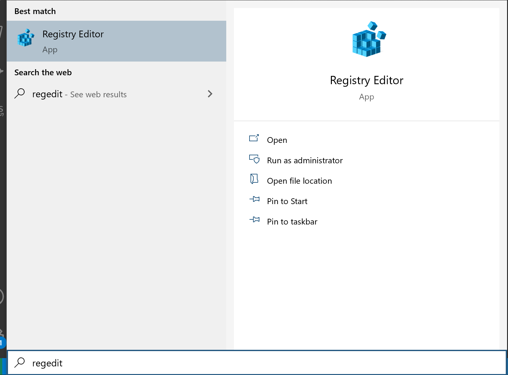
- Click the "open" button to open it...

## Step 2: Navigating to the right registry keys

There are two places we want to look, one place for files and then one for directories:

- Files: `HKEY_CLASSES_ROOT\*\shell`
- Directories: `HKEY_CLASSES_ROOT\Directory\shell`

## Step 3: Understanding the keys and values of other context menu items

If we take a look at the subkeys of the `HKEY_CLASSES_ROOT\Directory\shell` key we can see a list of what we can already do from our context menu:

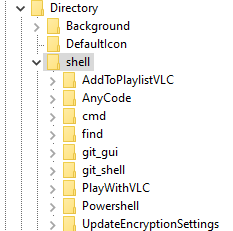

If we examine one more closely, we can see that there is a key with a descriptive name (e.g. the name of the program that appears on the context menu), with 2 string values: `(Default)`, which holds the text that is displayed on the context menu for this item, and `Icon` which contains a path to the program that you want to run, where the icon is then feched from:

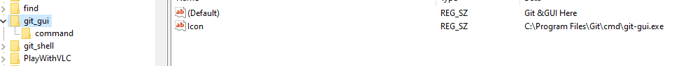

We can also see a subkey called `command`, which contains a string value, `(Default)` which contains the command you want to run:
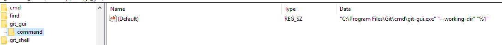

We can use this information to create the keys and values needed to add "Open with Code" to the context menu.

## Step 4: Adding the keys and values needed to add "Open with Code" to the context menu

Start off by creating a new key under the Directory\shell key:

- Right click the Directory\shell key
- Mouseover `New` in the context menu and then click `Key`

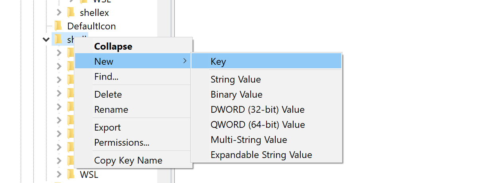

Call the key whatever you want, I went for VSCode to keep it descriptive.

From here, right click the `(Default)` value and select `Modify`:
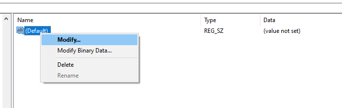

Enter what you want the text for the context menu option to read:
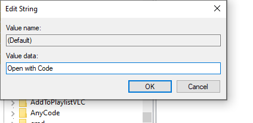

Next we want to create a new string value and name it `Icon`. To do this, right click in the body of the right hand panel, select `New`and then `String Value`:

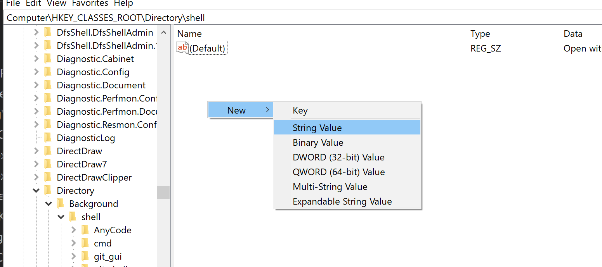

We then want to set the value to the path to the VSCode executable, in my case: `C:\Users\Dan\AppData\Local\Programs\Microsoft VS Code\Code.exe`.

Follow the same steps as the `(Default)` value above, but use the path to the VSCode executable. You should end up with two values that look something like this:

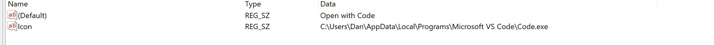

Now we need to add the command key under our VSCode (or whatever you called it) key (you learned how to create a new key at the start of step 4). We then need to set the value of the `(Default)` value in the `Command` key to the command we want to run: `"C:\path\to\VSCode\Code.exe" "%1"`. In my case it is `"C:\Users\Dan\AppData\Local\Programs\Microsoft VS Code\Code.exe" "%1"`. When you run this command from the context menu, the file or directory you had right clicked is passed as an argument, referenced by `"%1"`. So the command that is executed is: `Code.exe path\to\your\file\or\directory`. 

Once you have done this your `Command` key should look something like this:

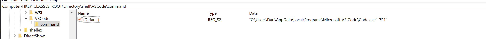

The final step is to logout and the log back in. After you have logged back in right click on a folder. You should find that you are able to open it in VSCode. To add "Open with Code" to the context menu for files, simply repeat the steps above except start from `HKEY_CLASSES_ROOT\*\shell`. Here's the final result:

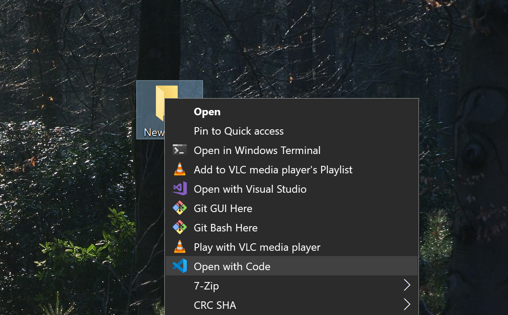

